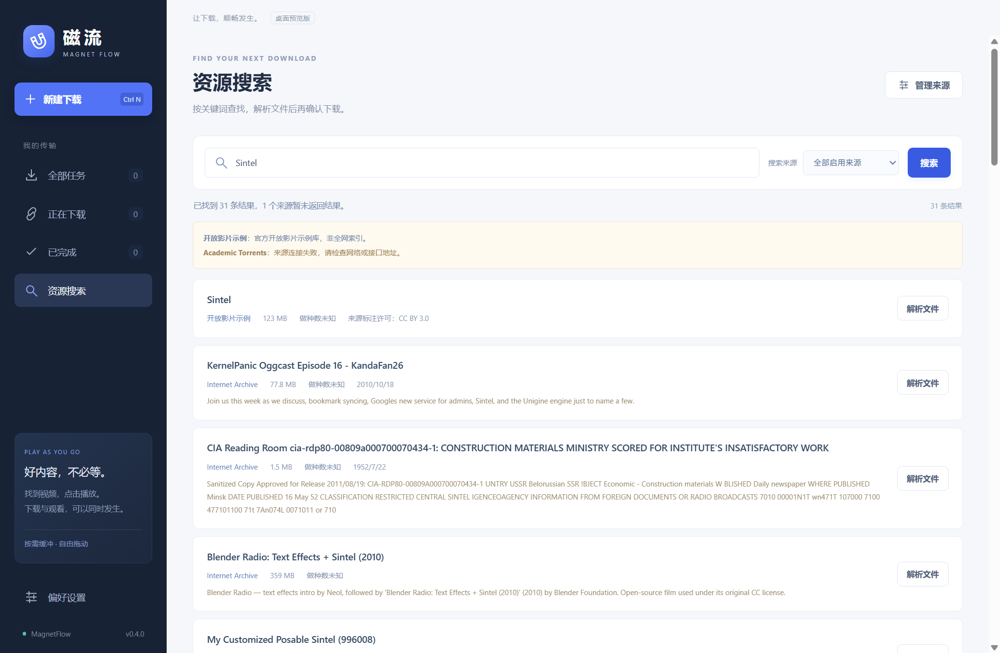

# 磁流 MagnetFlow

Windows 磁力下载与边下边播桌面客户端，当前版本 **0.4.0 预览版**。

采用 Electron、WebTorrent 和独立 FFmpeg 进程。先解析资源并选择文件，再开始下载；支持视频未下载完成时播放。



## 功能

- 导入磁力链接、BT v1 哈希和 `.torrent` 文件，解析元数据后勾选下载文件。
- 下载/上传限速、暂停与恢复、重启校验续传、任务搜索及打开下载目录。
- 使用 DHT、Tracker、PEX、种子自带 Web Seed 发现节点；提供连接诊断、速度诊断和元数据缓存。
- MP4/WebM 等浏览器支持的格式直接播放；MKV/AVI 等可通过 FFmpeg 实时转成 H.264/AAC 分片 MP4。
- 播放窗口优先缓冲当前区域及必要首尾片段，支持全屏及退出全屏。兼容播放提供按秒跳转。
- 内置 Internet Archive、Academic Torrents 搜索接口与三个官方开放影片示例；支持配置最多八个 Torznab API 来源。
- 搜索支持选择来源、分页、取消、逐来源返回与相同哈希合并，结果需要再次确认文件选择后下载。

## 从源码运行

要求 **Windows x64、Node.js 22 或更新版本、npm**，以及下载安装依赖所需的网络连接。

在仓库根目录执行：

```powershell
npm ci
node scripts/fetch-ffmpeg.mjs
npm start
```

`fetch-ffmpeg.mjs` 从 FFmpeg 官方下载页关联的 Gyan 提供者获取固定版本运行文件，校验 SHA-256，再提取 FFmpeg、ffprobe、许可与来源信息。需要 Windows 自带的 `tar`。应用运行时不会自行下载可执行程序。

仓库不提交 FFmpeg 二进制、媒体内容、用户设置或下载记录。未安装 FFmpeg 时，仍可直接播放浏览器支持的格式，兼容转码不可用。

若 npm 安装时未下载 Electron，可执行：

```powershell
node node_modules/electron/install.js
```

## 构建 Windows 程序

完成依赖和 FFmpeg 安装后执行：

```powershell
npm run dist
```

生成目录式应用 `dist/win-unpacked/`，运行其中的 `MagnetFlow.exe`。需要保留配套 DLL、resources 与 locales 等目录，不能只复制 EXE。

运行文件未进行商业代码签名。本仓库提供源代码及构建方法；第三方运行组件保留各自许可。

## 使用

1. 新建任务并粘贴磁力，或导入种子文件。
2. 等待解析完成，勾选需要的文件，点击“下载所选文件”。
3. 可确认后自动播放所选最大媒体文件，也可点击文件旁的播放按钮。
4. 播放模式默认自动；不兼容的格式会尝试内置转码。原生进度条用于直接播放，兼容播放用“跳转至 … 秒”。
5. 点击播放器全屏按钮，按 Esc 返回。
6. 在“资源搜索”中搜索、解析结果，再确认所需文件。可在“管理来源”中填写自己的 Torznab 接口及 API Key。

搜索不会自动下载结果的文件内容。来源报告的做种数未经客户端验证，连接节点数也不等于正在供数的节点数。

## 测试

```powershell
npm test
npm run test:ui
npm run test:compat
npm run test:fullscreen
npm run test:search
```

完整测试需要先安装 FFmpeg；桌面测试使用 ffprobe 开发工具，实际运行包不包含 ffprobe。测试内容由程序在本机生成，不依赖指定公网资源。

桌面测试会打开独立的临时窗口和数据目录。设置 `MAGNET_FLOW_EXE` 可测试已打包程序；设置 `MAGNET_FLOW_TEST_OUTPUT` 可指定截图位置，默认输出到仓库的 `work/`。

有关测试覆盖与观测数据，见 [验证记录](docs/TESTING.md)。公网来源可达性随网络变化，受控接口测试不保证所有公网来源在线。

## 数据与网络

- 默认下载目录为当前用户“下载”目录下的 `MagnetFlow`，每个任务使用哈希子目录。
- 任务及设置通常保存在 `%APPDATA%\MagnetFlow`；`MAGNET_FLOW_HOME` 可指定独立数据目录。
- API Key 使用操作系统加密后本地保存；不在搜索结果中回显。
- 下载时同时上传，完成后继续做种。新安装默认上传上限为 1024 KiB/s；暂停或退出停止传输。
- 升级前退出旧版，新版沿用原用户数据目录。更改下载目录只影响新任务。

## 范围与限制

- 仅验证 Windows x64。支持 BitTorrent v1 和包含 v1 哈希的混合种子，不支持 v2-only 或浏览器 WebRTC 节点。
- 解析和速度取决于资源节点、网络及端口可达性。没有可供数的节点时，更多 Tracker 不能生成缺失数据。
- 搜索不包含自建全网索引、第三方账号或 API Key，不能保证所有内容都能搜到。Academic Torrents 在部分网络环境可能无法访问。
- 文件可能共用边界片段；下载所选文件时，可能附带少量未选文件的边界数据。
- 已知私有种子只使用原始 Tracker，并停用公共发现。磁力解析前无法确定 private 标记；严格私有使用场景应导入原始 `.torrent`。
- FFmpeg 兼容播放最多一路、最高 1920×1080，使用 CPU 转码。编码不支持或节点数据不足时仍会缓冲。
- 尚未实现云端离线下载、会员加速、托盘、自动更新、硬件转码、字幕轨道管理、DRM 或系统磁力协议接管。
- 本项目是预览版，尚未通过独立安全审计。请只下载和分享你有权访问的内容。

## 代码结构

| 路径 | 用途 |
| --- | --- |
| `src/core.mjs` | 下载引擎、恢复、文件选择、缓冲及速度诊断 |
| `src/discovery.mjs` | 磁力归一化、Tracker 选择、元数据与 DHT 缓存 |
| `src/search-service.mjs` / `src/search-providers.mjs` | 搜索来源、聚合查询、缓存与种子解析 |
| `src/stream-server.mjs` | 仅监听回环地址的 Range 与转码服务 |
| `src/media-transcoder.mjs` | 独立 FFmpeg 进程和转码并发控制 |
| `src/main.mjs` / `src/preload.cjs` | Electron 主进程与受限 IPC |
| `src/ui/` | 中文界面 |
| `test/` / `scripts/` | 引擎与桌面测试、运行时下载工具 |

## 许可证与参考

项目自有代码采用 [MIT License](LICENSE)。第三方依赖保留各自许可；独立下载的 FFmpeg 构建包含 GPL v3 组件，不属于项目自有 MIT 代码。发布包含第三方运行文件的安装包时，应保留并满足其分发要求。

- [WebTorrent 文档](https://webtorrent.io/docs)
- [FFmpeg 下载](https://ffmpeg.org/download.html) / [Gyan Windows 构建](https://www.gyan.dev/ffmpeg/builds/)
- [Internet Archive 元数据接口](https://archive.org/developers/md-read.html)
- [Academic Torrents API](https://academictorrents.com/docs/api.html)
- [Torznab 规范](https://torznab.github.io/spec-1.3-draft/torznab/Specification-v1.3.html)

官方开放影片示例标明 CC BY 3.0；其余搜索资源的许可取决于具体发布者。
